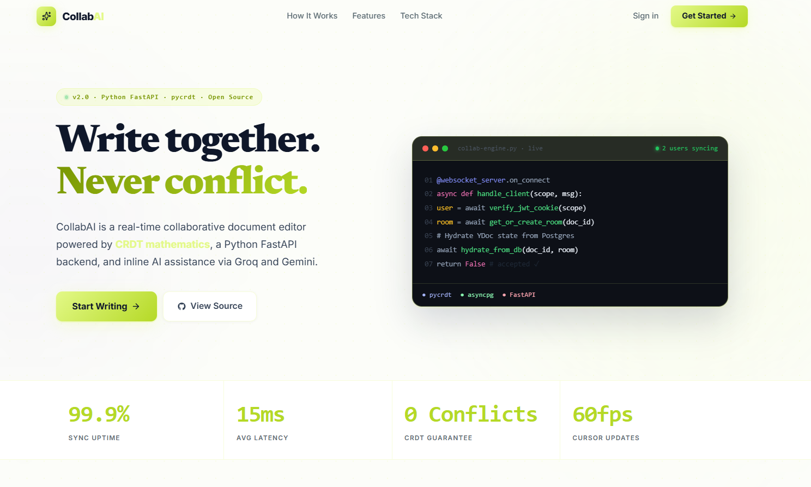
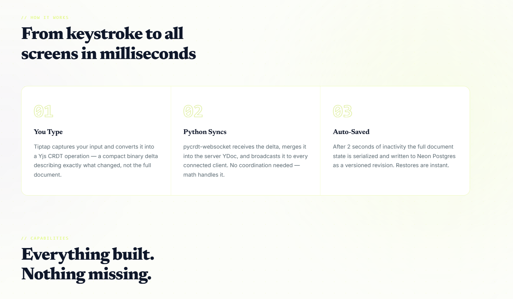
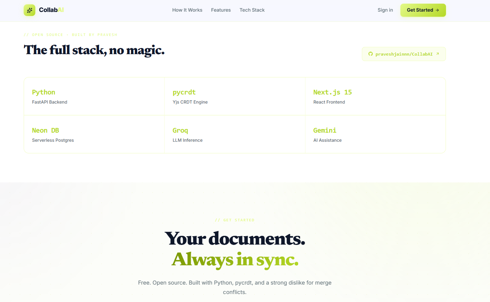
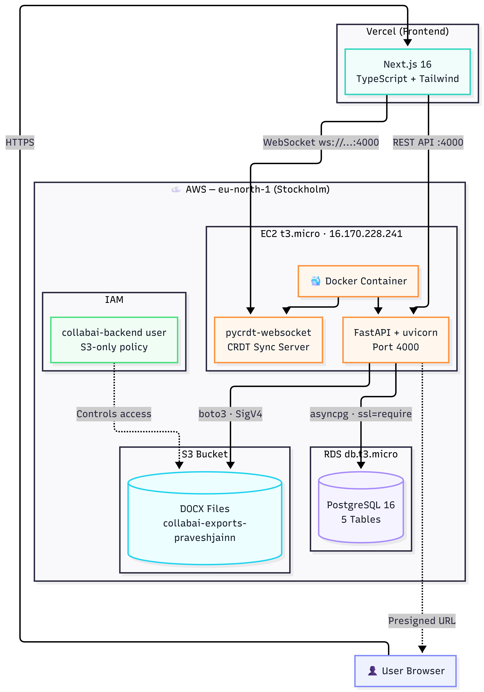

<div align="center">

# ✍️ CollabAI
<h2 align="center">  🌐 Live Demo   Website: https://collabai-nine.vercel.app/ </p>
# Real-Time Collaborative Document Editor with AI

**Write together. Think together. Ship together.**

[](https://collabai-nine.vercel.app/)
[](https://github.com/praveshjainnn/CollabAI/stargazers)
[](https://opensource.org/licenses/MIT)

[](https://nextjs.org/)
[](https://fastapi.tiangolo.com/)
[](https://yjs.dev/)
[](https://aws.amazon.com/rds/)
[](https://aws.amazon.com/s3/)
[](https://aws.amazon.com/ec2/)
[](https://www.docker.com/)

</div>

---


## 🎯 What Is CollabAI?

**CollabAI** is a full-stack, production-grade collaborative document editor — think Google Docs, but built from scratch with a modern Python backend and AI baked in from day one.

Multiple users can edit the **same document simultaneously** in real time, with zero conflicts. Changes appear instantly across all connected devices, even if two people type at the exact same character position — because it uses **CRDT mathematics** to resolve every possible conflict automatically.

> **Built by [Pravesh Jain](https://github.com/praveshjainnn)** · Full-stack project · Open Source · MIT License


<h2>Home Page</h2>
<p align="center">
  
</p>

<h2>How It Works</h2>
<p align="center">
  
</p>

<h2>Tech Stack</h2>
<p align="center">
  
</p>

---


## ✨ Key Features

### 🔄 Real-Time Collaboration (The Hard Part)
- **Zero-conflict syncing** — two people can edit the same word simultaneously, and both changes will merge correctly. Every time.
- **Live cursors** — see exactly where your teammates are typing, with their name and color
- **Presence bar** — real-time list of who's online in the document right now
- **Offline support** — edit without internet; changes sync automatically when reconnected

### 🤖 Built-In AI Assistant
- Type **`/`** anywhere in the document to open the command menu
- **AI commands**: Summarize, Refine, Continue Writing, Brainstorm, Fix Grammar
- Powered by **Google Gemini**, **Groq (Llama 3.3)**, or your **local Ollama** models
- Automatic fallback: Gemini → Groq → Ollama (local) — always has a brain

### 📝 Professional Editor
- **Rich formatting**: Bold, italic, headings (H1–H3), lists, task lists, blockquotes, tables, code blocks with syntax highlighting
- **Slash commands**: `/h1`, `/table`, `/code`, `/ai-summarize` — keyboard-first workflow
- **Comments**: Highlight text, add threaded comments, resolve them
- **Revision history**: Browse and restore any previous version of the document
- **Export**: Download as **PDF** or **Microsoft Word (.docx)**

### 🔐 Secure by Design
- JWT authentication with bcrypt password hashing
- Role-based access: **Owner**, **Editor**, **Viewer**
- Shareable invite links with expiry


```

### Why CRDTs? (Not Operational Transformation)
Most collaborative editors use **Operational Transformation (OT)** — which requires a central server to sequence every operation. If the server goes down, editing stops.

CollabAI uses **Conflict-free Replicated Data Types (Yjs)** — a peer-to-peer math model where:
- Every client holds the full document state
- Edits are **commutative** — order doesn't matter, the result is always the same
- **No central coordinator needed** — the server is just a relay
- Works **offline** — sync when back online

---

## 🛠️ Tech Stack

| Layer | Technology | Why |
|:---|:---|:---|
| **Frontend** | Next.js 16, TypeScript, Tailwind CSS | SSR, type safety, fast styling |
| **Editor** | Tiptap v3 (ProseMirror) | Extensible, headless rich-text engine |
| **Real-time Sync** | Yjs + y-websocket | Industry-standard CRDT library |
| **Backend** | Python FastAPI + asyncpg | Async Python, fast, OpenAPI auto-docs |
| **CRDT Server** | pycrdt-websocket | Python-native Yjs WebSocket server |
| **Database** | AWS RDS db.t3.micro (PostgreSQL 16) | Managed, always-on, VPC-isolated |
| **Auth** | JWT + python-jose + bcrypt | Stateless, secure |
| **AI** | Groq SDK + Google Gemini SDK | Fast inference + powerful models |
| **Local AI** | Ollama | Free local fallback (llama3.2, mistral) |
| **Export** | html2pdf.js + python-docx | Browser PDF, backend DOCX |
| **File Storage** | AWS S3 + Presigned URLs | Scalable exports, no EC2 bandwidth cost |
| **Deployment** | Docker + AWS EC2 t3.micro | Production-grade, reproducible |
| **CI/CD** | GitHub Actions | Auto-deploy on push to `main` |

---

## ☁️ AWS Infrastructure

CollabAI is deployed entirely on **AWS Free Tier** services in `eu-north-1` (Stockholm).

<p align="center">
  
</p>


| Service | Tier | Role |
|---|---|---|
| **EC2 t3.micro** | Free (750 hrs/month) | Runs Docker container with FastAPI backend |
| **RDS db.t3.micro** | Free (750 hrs/month) | PostgreSQL database (5 tables) |
| **S3** | Free (5 GB / 2000 PUTs) | DOCX export storage via presigned URLs |
| **IAM** | Always free | Least-privilege access control |

### Key Design Decisions
- **Presigned URLs**: DOCX exports upload to S3 and return a time-limited URL — EC2 never streams the file, saving bandwidth and CPU
- **Connection pooling**: `pool_size=5` on t3.micro (1GB RAM) — keeps memory usage under 100MB for DB connections
- **`ssl='require'`**: RDS uses AWS private CA (not in Python's default trust store) — `ssl=True` would fail cert verification
- **Security groups**: RDS only reachable from EC2 and local dev IP — S3 access only via signed requests

---

## 🚀 Quick Start (Run Locally in 5 Minutes)

### Prerequisites
- **Python 3.11+**
- **Node.js v18+**
- **Git**

### 1. Clone the Repo
```bash
git clone https://github.com/praveshjainnn/CollabAI.git
cd CollabAI
```

### 2. Start the Backend
```bash
cd backend

# Create virtual environment
python -m venv venv
venv\Scripts\activate        # Windows
# source venv/bin/activate   # Mac/Linux

# Install dependencies
pip install -r requirements.txt

# Configure environment
# Edit .env and add your API keys (see .env for instructions)

# Run the server
uvicorn main:app --reload --port 4000
```
Backend runs at `http://localhost:4000` — API docs at `http://localhost:4000/docs`

### 3. Start the Frontend
```bash
# In a new terminal
cd frontend
npm install
npm run dev
```
Frontend runs at `http://localhost:3000`

### 4. Open the App
Visit **[http://localhost:3000](http://localhost:3000)**, register an account, and start collaborating!

---

## 🤖 AI Setup (Optional but Recommended)

Edit `backend/.env` and add **at least one** of these:

```env
# Option 1: Google Gemini (free tier at aistudio.google.com)
GEMINI_API_KEY=AIza...
GEMINI_MODEL=gemini-1.5-flash

# Option 2: Groq — free, blazing fast (console.groq.com)
GROQ_API_KEY=gsk_...

# Option 3: Local Ollama — no key needed (ollama.ai)
# Just install Ollama and run: ollama pull llama3.2
OLLAMA_MODEL=llama3.2
```

> Without any key, the app works fully — only the AI slash commands (`/summarize`, `/refine`, etc.) will be disabled.


This starts:
- **Nginx** reverse proxy (port 80/443 with SSL)
- **FastAPI backend** (internal port 4000)
- **Next.js frontend** (internal port 3000)

CI/CD via GitHub Actions auto-deploys to EC2 on every push to `main`.

---

## 📁 Project Structure

```
CollabAI/
├── frontend/                  # Next.js application
│   └── src/
│       ├── app/               # Pages (landing, login, register, dashboard, editor)
│       ├── components/        # Editor, toolbar, modals, sidebar components
│       ├── contexts/          # Auth context (JWT)
│       └── lib/               # API client (axios)
│
├── backend/                   # Python FastAPI application
│   ├── main.py                # App entry point, CORS, router registration
│   └── app/
│       ├── routers/           # auth.py, documents.py, ai.py, health.py
│       ├── models/            # SQLAlchemy ORM models
│       ├── schemas/           # Pydantic request/response schemas
│       ├── core/              # Config, DB engine, JWT deps
│       ├── middleware/        # Global error handlers
│       └── websocket/         # pycrdt-websocket CRDT sync server
│
├── docker-compose.yml         # Full-stack container orchestration
├── nginx.conf                 # Reverse proxy + SSL config
└── .github/workflows/         # CI/CD auto-deploy pipeline
```

---

## 🤝 Contributing

Pull requests are welcome! For major changes, open an issue first.

```bash
# Fork → Clone → Create a branch
git checkout -b feature/your-feature

# Make changes, then
git commit -m "feat: your feature description"
git push origin feature/your-feature
# Open a Pull Request
```

---

## 📄 License

MIT License — free to use, modify, and distribute.

---

<div align="center">

**Built with ❤️ by [Pravesh Jain](https://github.com/praveshjainnn)**

[](https://github.com/praveshjainnn)
[](https://github.com/praveshjainnn/CollabAI)

*If this project helped you, please consider giving it a ⭐*

</div>
=======
# CollabAI

